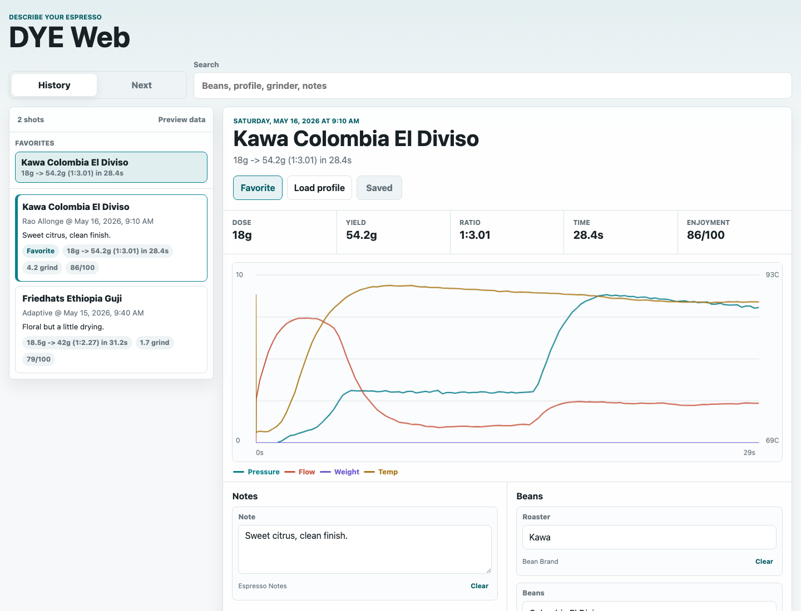
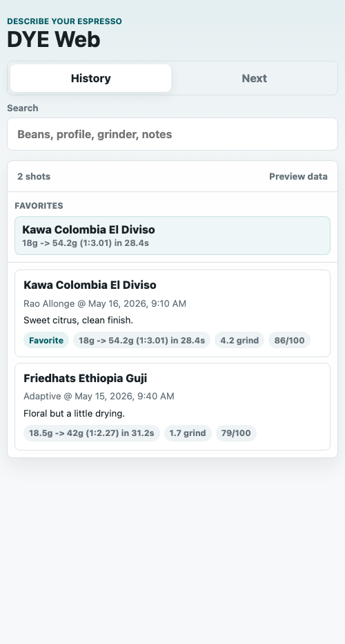
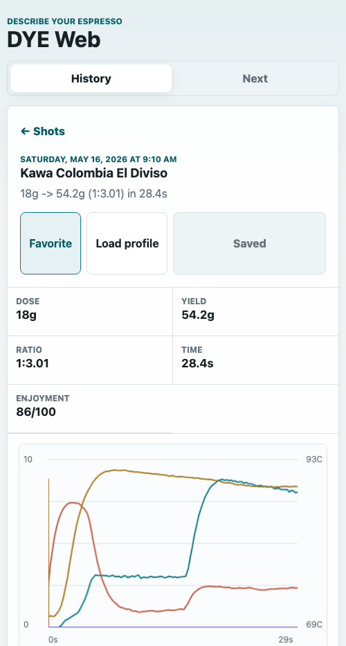

# DYE Web

DYE Web is a Decent DE1app plugin that serves a local, phone-friendly web app for browsing your espresso history and editing DYE description fields.

It is built for the moment after the shot, when the tablet UI is not the nicest place to type. Open DYE Web on your phone, find the shot, update the bean/grinder/tasting data, and save it back to the Decent shot file and SDB.

## What It Does

- Shows recent shots from SDB in a clean web interface
- Draws shot curves for pressure, flow, weight, and temperature
- Lets you edit DYE description fields inline, without pop-up edit dialogs
- Saves historical shot edits back to the `.shot` file and SDB description data
- Syncs edited fields to visualizer.coffee when a Visualizer link exists for the shot
- Lets you mark favorite shots and jump back to them quickly
- Can load the selected shot's profile onto the machine
- Includes a mock-data preview when opened outside DE1app

## Why

DYE is great because it gives espresso data structure: beans, roast, grinder, recipe, tasting notes, and people. The DE1 tablet is less great for reviewing a whole shot history or typing lots of small metadata edits.

DYE Web keeps the Decent tablet as the source of truth, but gives you a modern web surface for the tasks that feel better on a phone:

- compare previous shots
- quickly find a favorite reference shot
- fix missing bean or grinder values
- write notes while the taste is still fresh
- keep Visualizer and DYE metadata aligned

## Screenshots

The screenshots below use mock shot details with an example graph from a real Decent shot.







## Requirements

- Decent DE1 tablet running DE1app
- SDB plugin enabled
- DYE plugin enabled for description editing and profile loading
- Your phone and tablet on the same Wi-Fi network

## Installation

1. Download `dist/DYE_Web.zip` from this repo.
2. Copy the zip to the Decent tablet. A browser download, USB-C drive, cloud drive, or local network copy is fine.
3. Open the Android `Files` app on the tablet.
4. Find `DYE_Web.zip` and extract it.
5. You should now have a folder named `DYE_Web`.
6. Copy or move the whole `DYE_Web` folder into:

```text
Internal storage/de1plus/plugins/
```

The final layout should look like this:

```text
de1plus/
  plugins/
    DYE_Web/
      plugin.tcl
      DYE_Web.tcl
      web/
        index.html
        app.js
        styles.css
```

7. Restart the Decent app, or go to `Settings > App > Extensions`.
8. Enable `SDB`, `DYE`, and `DYE Web`.

## Opening The Web App

By default, DYE Web listens on port `8787`.

From a phone on the same Wi-Fi network, open:

```text
http://<tablet-ip>:8787/
```

For example:

```text
http://192.168.1.42:8787/
```

You can usually find the tablet IP address in Android Wi-Fi settings, your router's device list, or any network scanner app.

## Using It

- Tap a shot in History to open its detail view.
- Use Search to find shots by beans, profile, grinder, or notes.
- Tap `Favorite` on important shots to keep them in the Favorites list.
- Edit fields directly in the shot detail view.
- Tap the floating save button when it appears.
- Tap `Load profile` to load that shot's espresso profile onto the machine.
- Open the Visualizer link from the detail view when the shot has one.

## Notes

- DYE Web is local to your network. It does not publish your data to the internet.
- The tablet remains the source of truth. The web app talks to the plugin running inside DE1app.
- Visualizer sync only happens when the shot already has a Visualizer link.
- If the web UI is opened outside DE1app, it falls back to mock data so you can still see the interface.
